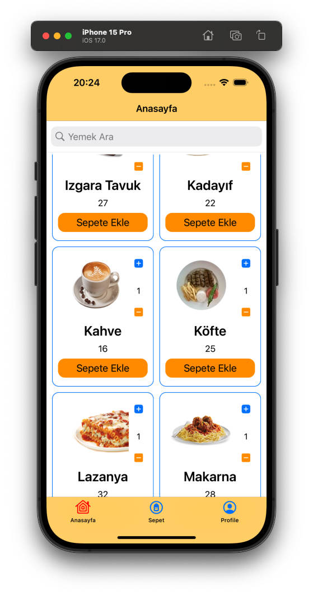
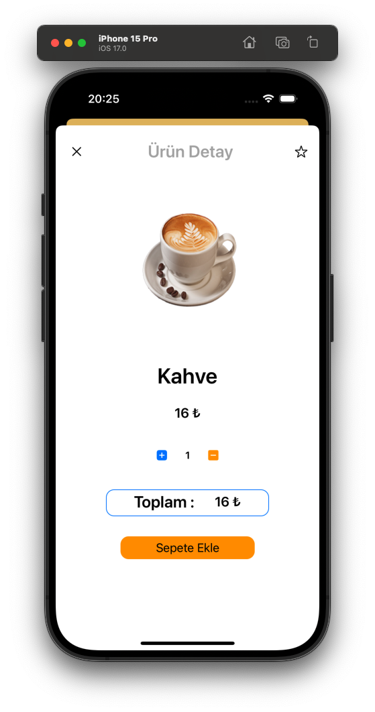
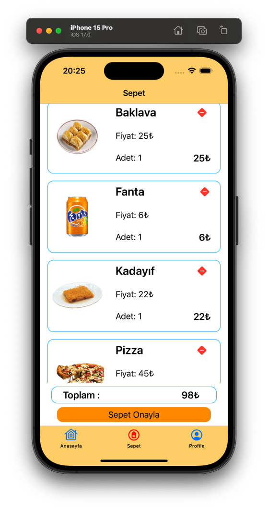
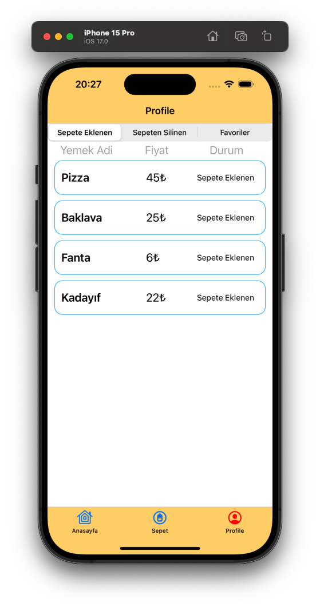

# OrderAppNoStoryboard
<table>
  <tr>
    <td width="15%">MVVM</td>
    <td width="15%">Programatic UI</td>
    <td width="15%">Alamofire</td>
    <td width="25%">Firebase</td>
    <td width="25%">KingFisher</td>
  </tr>
</table>

    

<table>
  <tr>
    <td width="25%">Anasayfa</td>
    <td width="25%">Detay</td>
    <td width="25%">Sepet</td>
    <td width="25%">Activity</td>
  </tr>
  <tr>
    <td>-Yemek Listelenme, Arama, Sepete Ekleme</td>
    <td>- Ürün Detay, Favorilere ekleme, Sepete Ekleme</td>
    <td>- Sepeteki ürünlerin listeleneme, Sepeten ürün çıkarma</td>
    <td>- Sepete Eklenen, Silinen, Favoriye alınan ürünlerin Listelenmesi</td>
  </tr>
</table>

